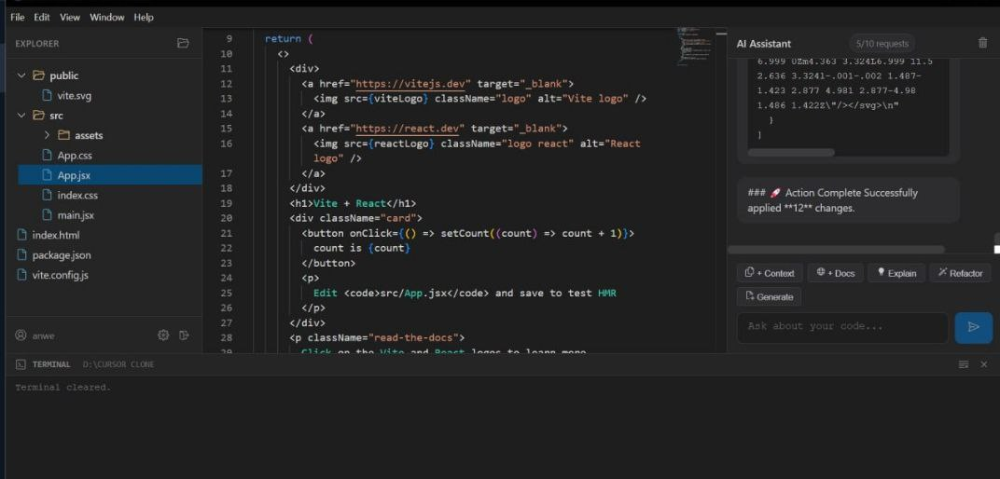
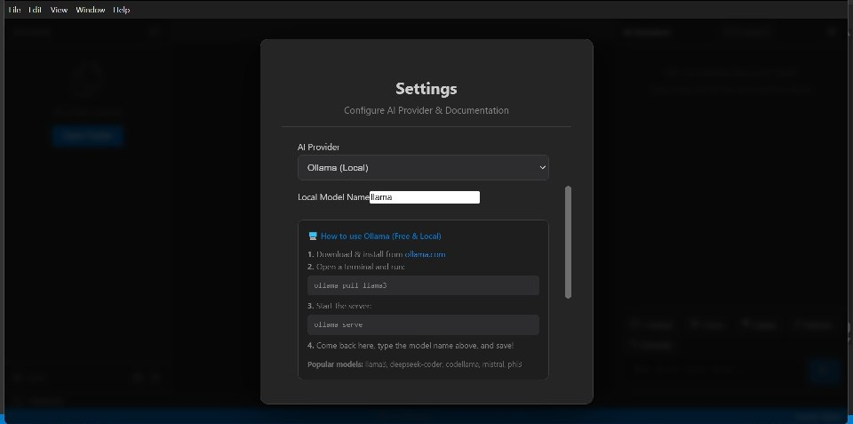

# Polaris IDE (Cursor Clone) 🌟

A modern, AI-powered code editor built with React, Electron, and Monaco Editor. This project recreates the core experience of Cursor, featuring a ghost-text AI assistant, multi-file context awareness, and a premium "Polaris" UI theme.

## Screenshots

| Editor with AI Chat | Editor with Terminal | Ollama Configuration |
| :---: | :---: | :---: |
|  |  |  |

## Features

- **AI Integration**: 
  - **Ghost Text**: Intelligent inline code completion.
  - **Chat Assistant**: Multi-turn conversations with file context awareness.
  - **Quick Edit**: Select code and apply AI transformations instantly.
  - Supports **Google Gemini**, **Anthropic**, and **OpenAI** models. Also supports local models like **Ollama**.

- **Real-time Context**:
  - **File Streaming**: Agentic file operations happen in real-time with visual indicators.
  - **Documentation Crawling**: Add external docs (via Firecrawl) to your AI context.
  - **Live Preview**: Built-in browser preview for web development.

- **Premium UI/UX**:
  - "Polaris" Dark Theme with glassmorphism and smooth animations.
  - Custom tabs, file explorer, and setting modals.
  - Optimized for Windows.

## Contributing   

Contributions are welcome! Please feel free to submit a Pull Request.

## License

This project is open-source and available under the [MIT License](LICENSE).
